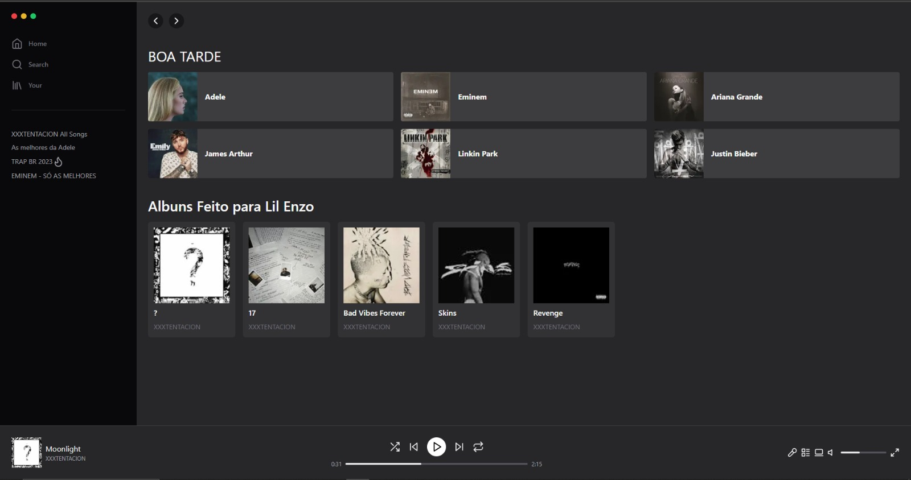

<p align="center">
  <a href="#-tecnologias">Tecnologias</a>&nbsp;&nbsp;&nbsp;|&nbsp;&nbsp;&nbsp;
  <a href="#-projeto">Projeto</a>&nbsp;&nbsp;&nbsp;|&nbsp;&nbsp;&nbsp;
  <a href="#memo-licença">Participantes</a>
</p>


## 💻 Projeto

A ideia deste projeto foi clona a ui do Sportify. 


### 💻 Link

sportify-5pg7eq6fj-hurtykg.vercel.app

## Participantes


[Enzo Oliveira](https://www.linkedin.com/in/enzo-oliveira-a18344229/)


## Tecnologias
- [x] NextJs
- [x] CSS
- [x] TypeScript


## Como utilizar?

1. Baixe esse repositório e com o seu o terminal, entre no diretório

2. Rode o comando `npm install` ou `Yarn` para instalar as dependências.

3. E pra iniciar a aplicação.

```bash
npm run dev
# or
yarn dev
# or
pnpm dev
```


